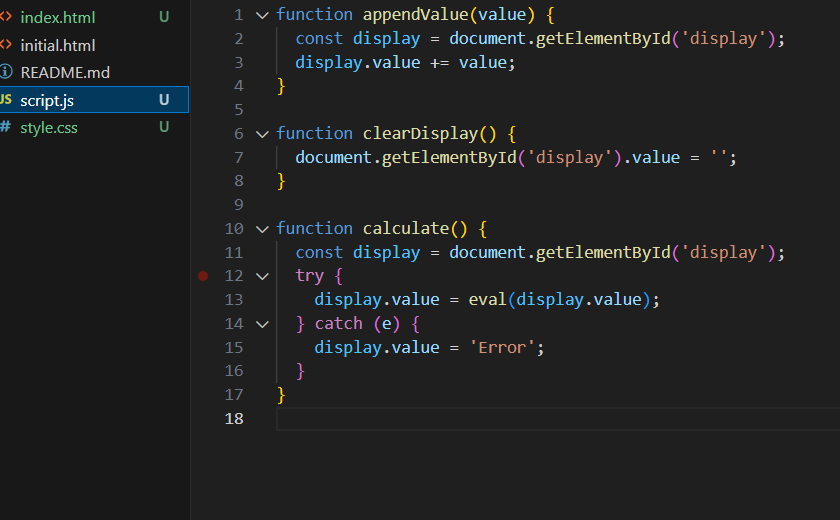

# beginner
~calculator
I learned how to use DOM manipulation to update the calculator display dynamically,Creating a responsive grid layout with CSS Grid.
Enjoyable part was implementing the button grid and seeing how clicking each button updates the display in real time. 
If more time were available calculation history panel

[Watch demo](demo.mp4)

